# SENNA  
Spatial Expression aNalysis with spliNe Axes  
(2025-08-12 Minseok Lee)

<br/>

## Description  
SENNA is a user-interactive framework that maps spots from spatially resolved transcriptomics and proteomics datasets onto a ‘curve axis’—a user-drawn path or region boundary on the tissue.  

<br/>

## Installation  

```
install.packages("devtools")
library(devtools)
install_github("Dalmooree/SENNA")
```

or  

```
install.packages("remotes")
library(remotes)
install_github("Dalmooree/SENNA")
```

<br/>

## Run  
### Load packages  
```
library(Seurat)
library(SENNA)
library(patchwork)
```

### Pre-processing  
The sample dataset is available at [10X Genomics repository](https://www.10xgenomics.com/datasets/mouse-brain-coronal-section-1-ffpe-2-standard).


```
# Set data path
dpath <- "../dataset/st/CytAssist_FFPE_Mouse_Brain_Rep1_filtered"

# Load SRT data as `Seurat` object
surt <- Load10X_Spatial(data.dir = dpath,
                        filename = "CytAssist_FFPE_Mouse_Brain_Rep1_filtered_feature_bc_matrix.h5",
                        slice = "mb",
                        filter.matrix = TRUE,
                        image = NULL)

if(min(surt$nCount_Spatial) == 0) surt <- subset(surt, nCount_Spatial > 0)
# `NormalizeData()` also works
surt <- SCTransform(surt, assay = "Spatial", verbose = FALSE)

# Optional pre-processing
surt <- RunPCA(surt, verbose = FALSE)
surt <- FindNeighbors(surt, verbose = FALSE)
surt <- FindClusters(surt, verbose = FALSE)
```

<br/>

### `SENNA` object creation and knots picking    
```
# Create SENNA object
sen <- SENNA_Visium(surt,
                    slice_name = "mb",
                    annotation = TRUE)

## Use `SENNA_Xenium()` for Xenium datasets  
## Use `SENNA_CODEX()` for CODEX datasets  
## Use `SENNA_CosMx()` for CosMx datasets  
```
<br/>

1. Knots picker with default option  
```
AppDat(sen)
knot_picker()
```

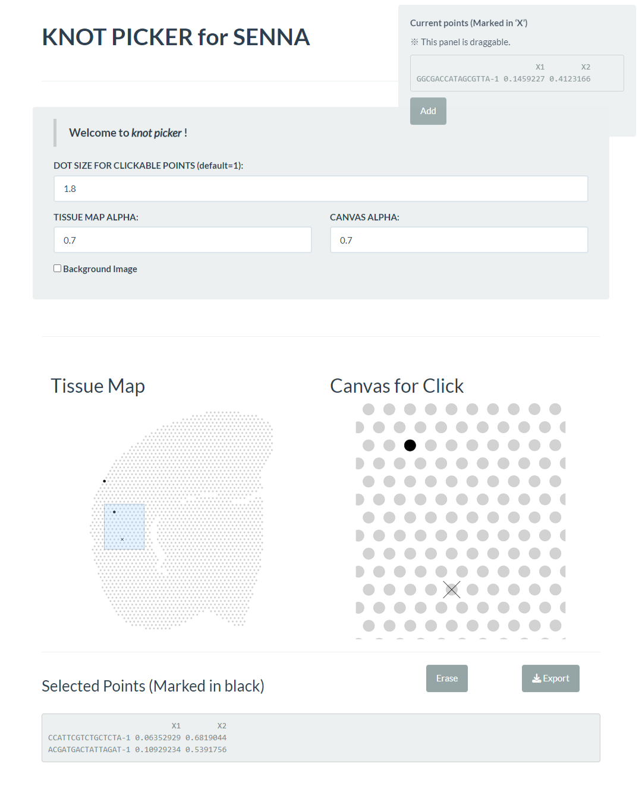

<br/>

2. Knots picker with tissue image (Visium and VisiumHD only)
```
# Tissue image path
ipath <- "../dataset/st/CytAssist_FFPE_Mouse_Brain_Rep1_filtered/spatial/"
AppDat(sen,
       image_path = ipath,
       image_resolution = "lowres") # or "hires"
knot_picker()
```

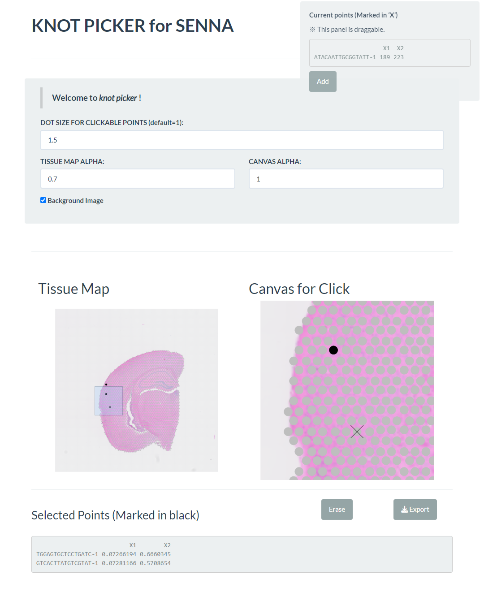

<br/>

3. Knots picker with discrete spot attribute (e.g. Clusters, cell types, etc.)  
```
# List of available reference values
names(sen@Gene$Reference)
AppDat(sen,
       reference_value = "Annotation",
       colorset = ggsci::pal_npg("nrc")(9),
       image_path = ipath,
       image_resolution = "lowres")
knot_picker()
```

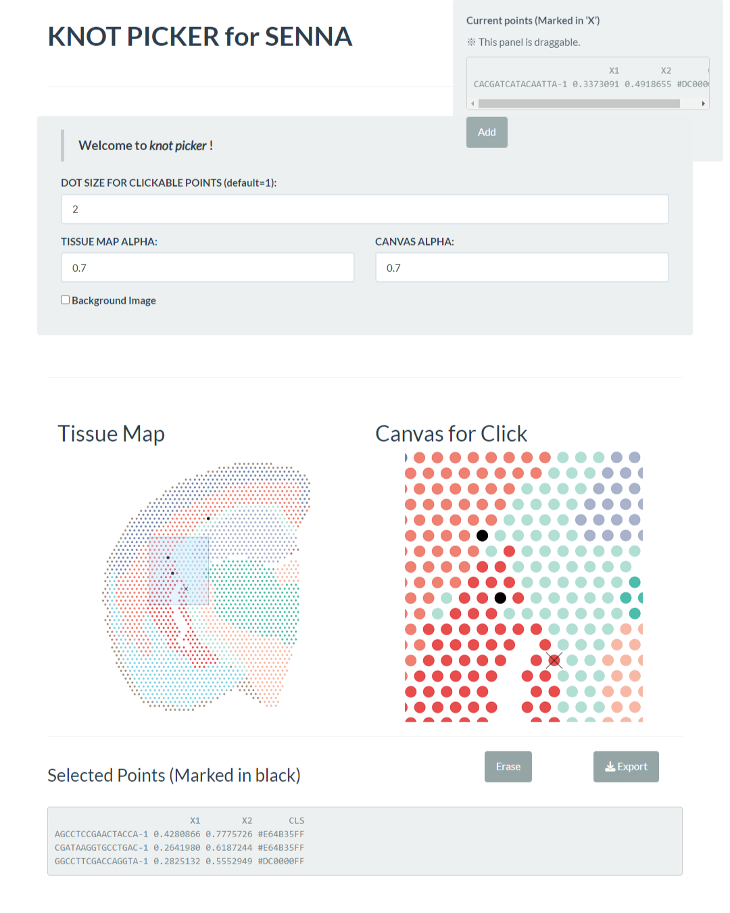

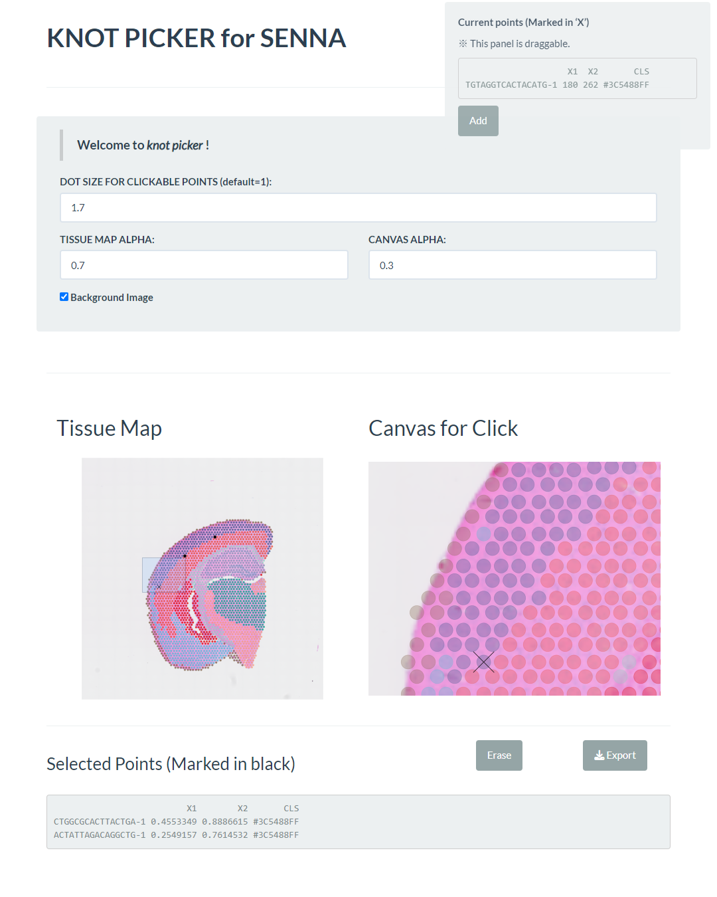

<br/>

4. Knots picker with continuous spot attribute (e.g. Expression level, CNV score, etc.)  
```
# Add a reference variable
sen <- AddReference(sen,
                    var_name = "Ttr Expression", # Variable name
                    reference = sen@Gene[["Spatial"]][["Ttr"]] # Value
                    )
AppDat(sen,
       reference_value = "Ttr Expression",
       colorset = c("darkblue", "darkred"),
       image_path = ipath,
       image_resolution = "lowres")
knot_picker()
```

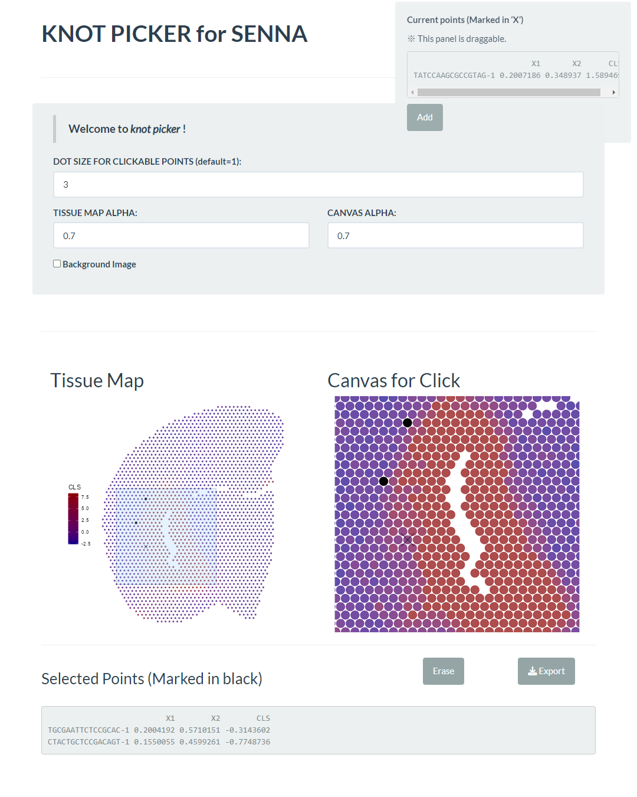

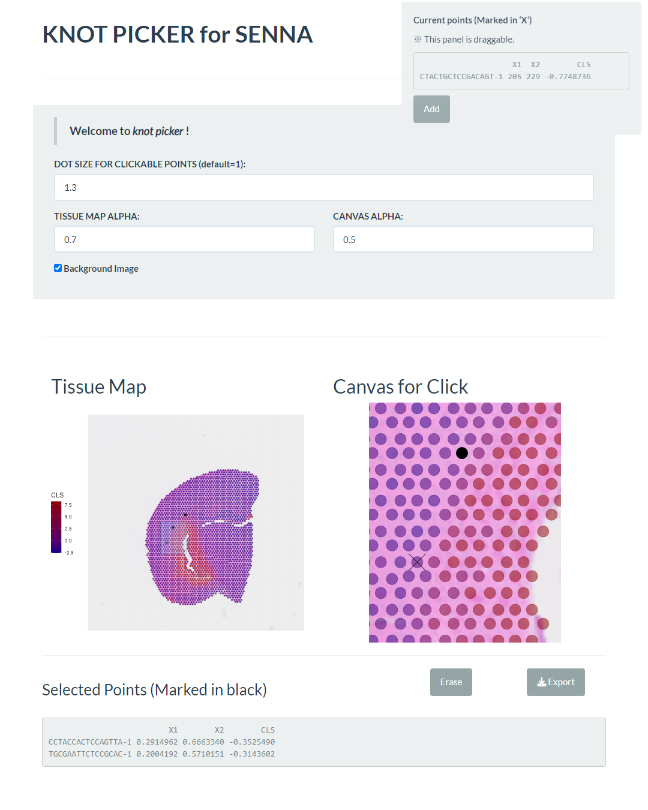

<br/>

### Curve axis generation and projection  
```
# Load knots (progression model)
prog_knots <- read.csv(
  system.file("extdata", "mb_prog.csv", package = "SENNA") # file path
)

# Generate curve axis
## Use `FullCurve()` for full-curve axis
sen_prog <- TrimmedCurve(sen, prog_knots, type = "spline")
ShowCurve(sen_prog)
```
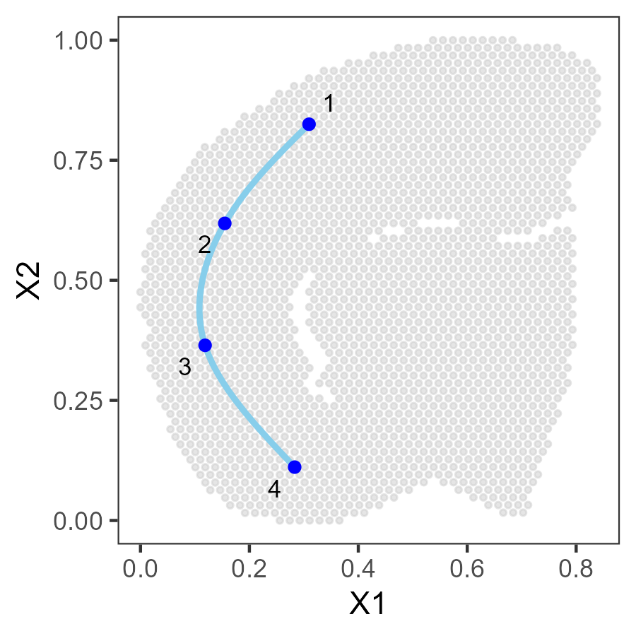

```
# Compute curve parameters and distances
sen_prog <- GetCurveParam(sen_prog)
```

<br/>
<br/>

### (Optional) CSD computation
This step is performed only in regionation and islet analysis scenarios.  
<br/>

```
# Load knots (islet model)
isl_knots <- read.csv(
  system.file("extdata", "mb_islet.csv", package = "SENNA") # file path
)

sen_isl <- TrimmedCurve(senna = sen, 
                        knot_df = isl_knots, 
                        type = "islet")
ShowCurve(sen_isl,
          order_label = FALSE,
          color_reference = "Annotation",
          bg_dot_size = 0.7,
          bg_dot_alpha = 0.5,
          line_color = "#555555",
          knots_color = "#000000") +
  guides(color = "none")
```

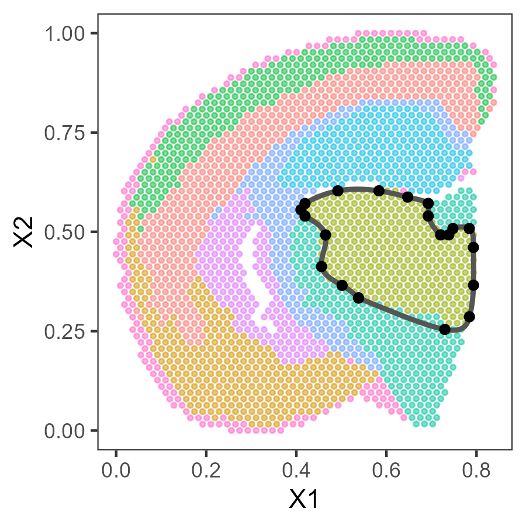

```
sen_isl <- GetCurveParam(sen_isl)

# Compute C-S distance
sen_isl <- TissueRegionation(sen_isl)

pl <- ShowRegions(sen_isl)
pr <- ShowCSDistance(sen_isl) + 
  theme_test() +
  theme(axis.title = element_blank(),
        axis.ticks = element_blank(),
        axis.text = element_blank())
pl + pr
```

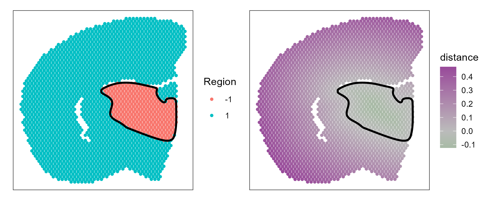

<br/>

### SVG detection

1. Progression model  
```
## Auxiliary plot for selecting the `interval` parameter
## Only blue spots are inputs of the SVG model
ScanInterval(sen_prog, interval = 0.1, dot_size = 0.7,dot_alpha = 0.5)
```

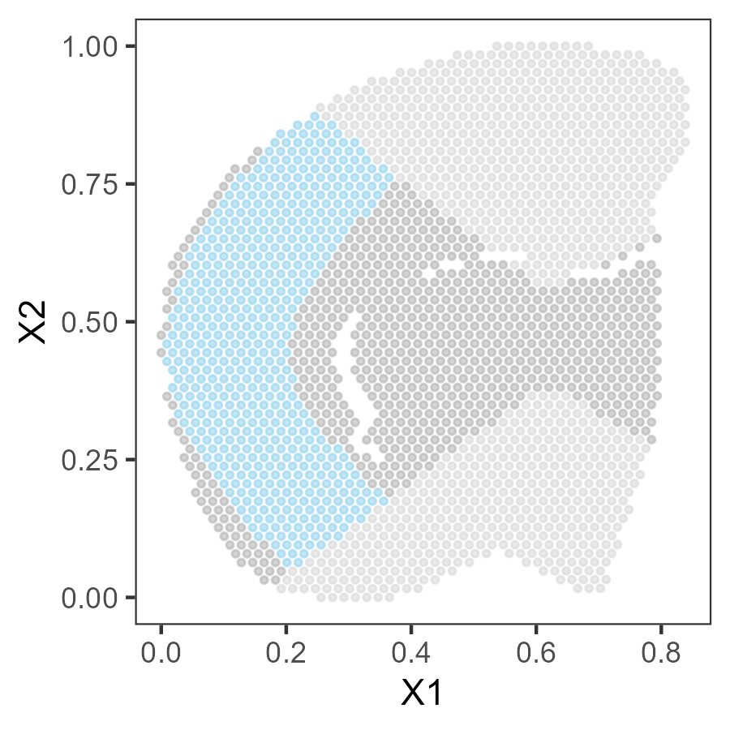

```
sen_prog <- ProgSVGs(sen_prog,
                     weight = "box", # or "gaussian"
                     FDR_level = 0.01,
                     grad_cutoff = 0.1,
                     active = FALSE, # If `TRUE`, only include spots (cells) selected by 'ActiveIdent()'
                     interval = 0.1)

ProgVolPlot(sen_prog,
            FDR_level = 0.01,
            grad_cutoff = 0.1,
            nrepel = 10)
```

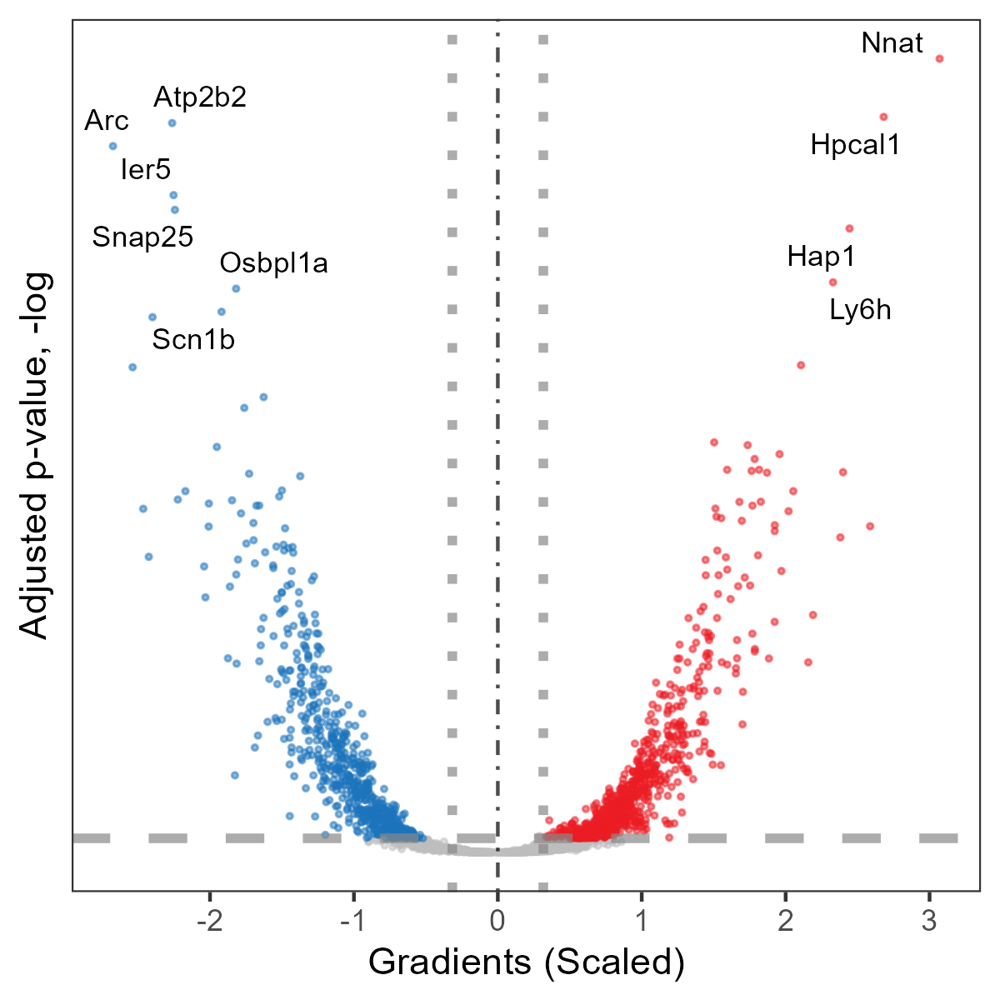


<br/>

2. Islet model (regionation model)  
```
sen_isl <- RegionSVGs(sen_isl,
                      FDR_level = 0.01,
                      grad_cutoff = 0.1,
                      active = FALSE,
                      direction = -1 # set `NULL` for regionation model
                      )
RegionVolPlot(sen_isl,
              FDR_level = 0.01,
              grad_cutoff = 0.1,
              nrepel = 10)
```

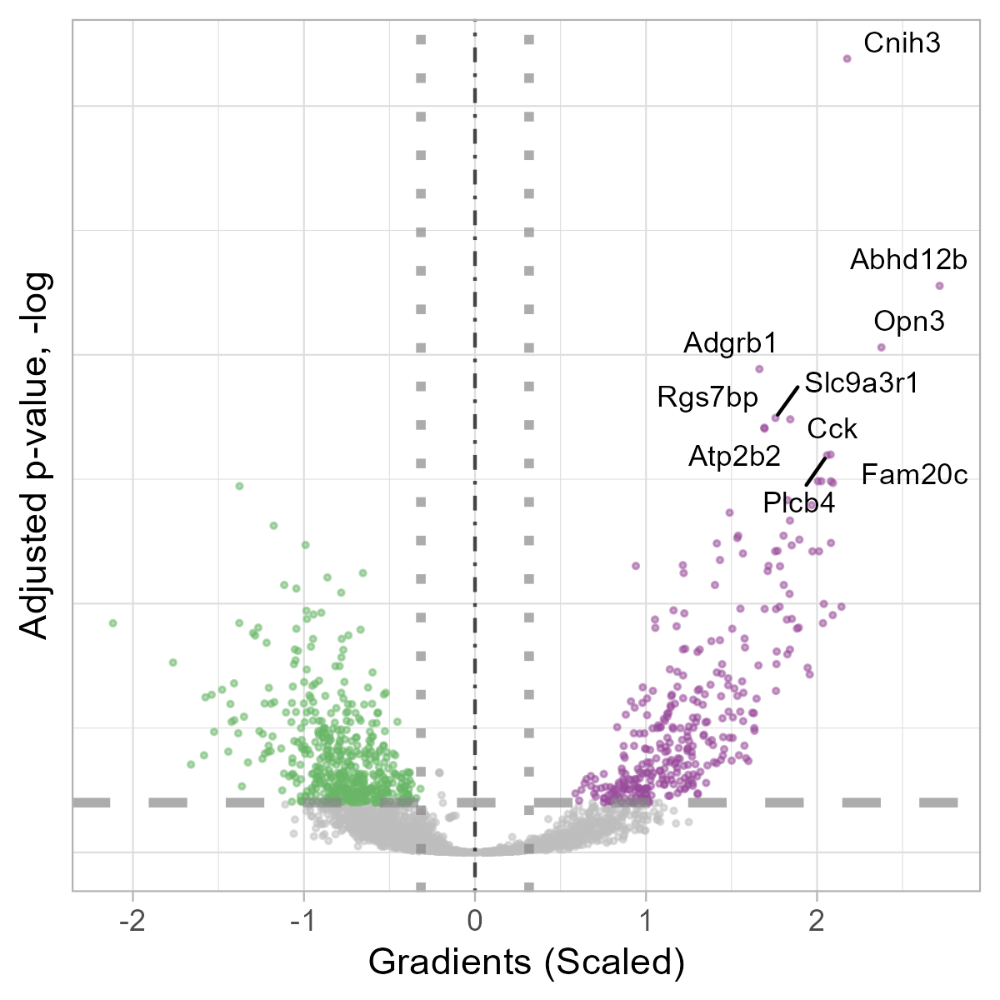

<br/>

## License  
This software is distributed under a non-commercial license. See [LICENSE](LICENSE) for details.  

## Citation  

